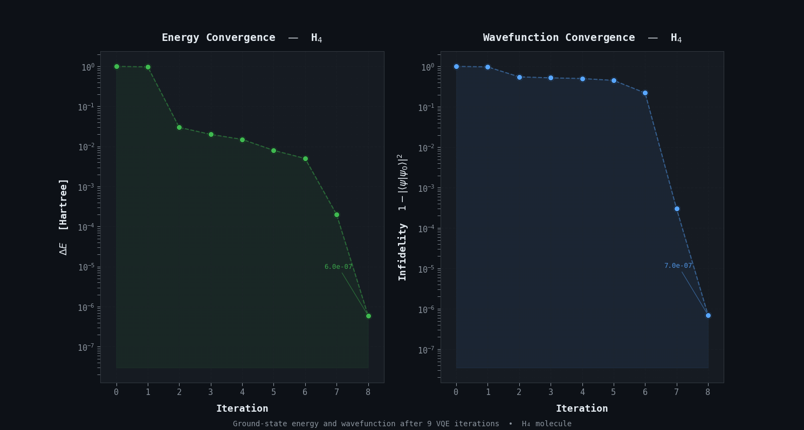

<div align="center">

# ⚛️ ADAPT-VQE

**Adaptive Variational Quantum Eigensolver — H₄ molecule ground state with JAX**

[](https://python.org)
[](https://github.com/google/jax)
[](LICENSE)
[]()

</div>

---

## What is this?

This repository implements the **ADAPT-VQE** algorithm to find the ground-state energy and wavefunction of a **hydrogen chain H₄** molecule (8 qubits after Jordan–Wigner transformation). It uses **JAX** for JIT-compiled matrix exponentials and automatic differentiation, combined with **BFGS** optimization from SciPy and built overnight.


The key idea of ADAPT-VQE over standard VQE: instead of committing to a fixed ansatz, the circuit grows **one operator at a time**, always picking the operator with the largest energy gradient. This produces compact, chemically informed ansätze with far fewer parameters — ideal for near-term (NISQ) devices.

---

## Algorithm overview

```
Reference state |HF⟩  ──►  Compute ⟨[H, Aₖ]⟩ for all Aₖ in pool
                                           │
                               Select Aₖ with max |gradient|
                                           │
                           Append exp(-iθₖ Aₖ) to the ansatz
                                           │
                           Optimize ALL θ parameters with BFGS
                                           │
                          ΔE = |E - E₀| < threshold ?  ──► Done
                                           │ No
                                   Back to gradient step
```

**Operator pool** — `XY` pairs and `XYYY` quadruples (preserves particle number and spin symmetry):

$$A_k \in \{X_i Y_j\} \cup \{X_i Y_j Y_k Y_l\}$$

**Convergence metric** — both energy error ΔE and wavefunction infidelity are tracked each iteration:

$$\Delta E = |E_{\text{ADAPT}} - E_0|, \qquad \mathcal{F} = 1 - |\langle \psi_0 | \psi_{\text{ADAPT}} \rangle|^2$$

---

## Results — H₄ convergence

After 9 iterations, ADAPT-VQE reaches chemical accuracy on both energy and wavefunction:



| Iteration | ΔE (Hartree) | Infidelity |
|:---------:|:------------:|:----------:|
| 0 | ~1 | ~1 |
| 4 | ~1.5 × 10⁻² | ~5 × 10⁻¹ |
| 7 | ~2 × 10⁻⁴ | ~3 × 10⁻⁴ |
| **8** | **~6 × 10⁻⁷** | **~7 × 10⁻⁷** |

Both quantities converge to below 10⁻⁶ — well within chemical accuracy (1 kcal/mol ≈ 1.6 × 10⁻³ Hartree).

---

## Requirements

```
python >= 3.9
jax >= 0.4
jaxlib
numpy
scipy
matplotlib
```

Install with:

```bash
pip install jax jaxlib numpy scipy matplotlib
```

> **JAX note:** the code enables 64-bit precision via `jax.config.update("jax_enable_x64", True)`, which is required for numerical accuracy in quantum chemistry. Make sure your `jaxlib` build supports it (default CPU builds do).

---

## Project structure

```
ADAPT-VQE/
├── h4closed.py          # Main ADAPT-VQE loop for H₄
├── dataforadapt.py      # H₄ Hamiltonian data after Jordan–Wigner transform
│                        #   → h4closedfermion() returns the 256×256 Hamiltonian matrix
├── h4closedfigure.png   # Convergence plots (ΔE and infidelity vs. iteration)
└── README.md
```

---

## Usage

### 1. Set up the Hamiltonian data path

The script imports `dataforadapt`, which contains the precomputed Jordan–Wigner Hamiltonian for H₄. Set the correct path at the top of `h4closed.py`:

```python
sys.path.append("/path/to/dataforadapt/")
```

### 2. Set the output paths

Two paths need to be configured inside `h4closed.py`:

```python
# Path to save the selected operators at each iteration
with open("/path/to/operators.txt", "a") as text_file: ...

# Path to save the optimized parameters
np.savetxt('/path/to/parameters.csv', xparameters, delimiter=',')
```

### 3. Run

```bash
python h4closed.py
```

The script prints per-iteration diagnostics and displays the convergence plots at the end:

```
E_ADAPT    E_exact    ΔE         iter   Infidelity
-2.1651    -2.1651    6.4e-07    8      7.1e-07
```

---

## Key implementation details

| Component | Choice | Why |
|-----------|--------|-----|
| Operator pool | XY + XYYY Pauli strings | Preserves particle number & parity |
| Reference state | Hartree–Fock `|1111 0000⟩` | Best single-Slater-determinant approximation |
| Optimizer | BFGS (SciPy) with JAX gradients | Second-order convergence, analytic gradients |
| Linear algebra | JAX JIT-compiled `jnp.linalg.multi_dot` | GPU-ready, fast matrix chains |
| Precision | `jax_enable_x64 = True` | Avoids float32 numerical noise |
| Stopping criterion | ΔE < 10⁻⁷ Hartree | Sub-chemical-accuracy threshold |

---

## Background

The **Variational Quantum Eigensolver (VQE)** minimizes the energy expectation value over a parameterized state:

$$E(\boldsymbol{\theta}) = \langle \psi(\boldsymbol{\theta}) | H | \psi(\boldsymbol{\theta}) \rangle \geq E_0$$

Standard VQE uses a fixed ansatz (e.g. UCCSD), which may include unnecessary parameters. **ADAPT-VQE** removes this overhead by building the ansatz greedily: at each step it identifies the single operator from a predefined pool that would reduce the energy fastest (largest gradient norm), appends it, and re-optimizes all parameters from scratch. The loop terminates when ΔE falls below a threshold.

For H₄ in the closed-shell configuration with the XY+XYYY pool, 9 operators suffice to reach near-exact ground-state energy.

---

## References

1. **Grimsley et al.** — *An adaptive variational algorithm for exact molecular simulations on a quantum computer.* Nature Communications **10**, 3007 (2019). [doi:10.1038/s41467-019-10988-2](https://doi.org/10.1038/s41467-019-10988-2)

2. **Peruzzo et al.** — *A variational eigenvalue solver on a photonic quantum processor.* Nature Communications **5**, 4213 (2014). [doi:10.1038/ncomms5213](https://doi.org/10.1038/ncomms5213)

3. **Bradbury et al.** — *JAX: composable transformations of Python+NumPy programs.* [github.com/google/jax](https://github.com/google/jax)
